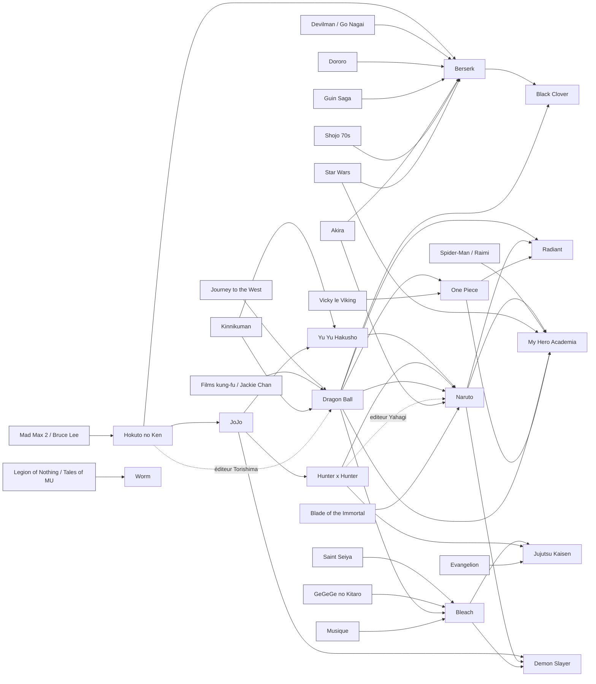

# Frise chronologique et réseau d'influences — version 3

**Objet :** cartographier, avec un niveau de preuve explicite, les filiations réellement documentées entre les œuvres de ton corpus de référence — et séparer fermement ce qui est *attesté*, *médié*, *contextuel* ou *simplement ressemblant*.

**Périmètre :** les œuvres et liens nommés dans la demande, plus les antécédents strictement nécessaires pour vérifier ou invalider ces liens. La v2 ajoute une **couche d'amont** (Tezuka, Nagai, *GeGeGe no Kitarō*, *Akira*, shōjo des années 1970, *Guin Saga*) sans laquelle plusieurs flèches du corpus restent incompréhensibles.

**Date de vérification :** 5 octobre 2026. Les ajouts v2 et v3 sont signalés dans le journal des modifications (§ 10).

**Statut du document :** couche de **recherche secondaire**. Il ne remplace pas tes données de lecteurs ni ton dépôt, qui n'a pas été consulté. Pour intégrer tes notes sur Gege Akutami, colle ici les extraits ciblés à utiliser.

**Fichiers compagnons :** `relations_influences_v3.csv` (séparateur `;`) — un lien par ligne, avec source, cible, portée, niveau de preuve et référence.

---

## 1. Méthode : comment une flèche est accordée (ou refusée)

### 1.1 Les quatre types de liens

| Notation | Nom | Ce qu'il faut pour l'obtenir | Ce qu'il n'autorise **pas** |
|---|---|---|---|
| `══▶` | **Influence attestée** | Déclaration d'auteur, d'éditeur, ou description officielle explicite | Généraliser à l'œuvre entière si la déclaration vise un élément |
| `─[médiation]▶` | **Influence médiée** | Influence réelle, mais transmise par une décision éditoriale, un employeur, un studio, un assistanat | Attribuer l'intention à l'auteur lui-même |
| `···▶` | **Parenté de genre / contexte** | Voisinage historique, éditorial ou générique vérifiable | Affirmer une causalité |
| `?▶` | **Non vérifié** | Hypothèse plausible sans source suffisante | Être dessiné comme une influence |
| `══╳▶` | **Écart délibéré** (v3) | L'auteur déclare s'être inspiré de X *pour s'en éloigner* ou avoir retiré ce qui en venait | Compter X comme modèle positif |
| `♪▶` | **Influence non narrative** (v3) | Musique, architecture, mode, documentation : source déclarée qui n'est pas un récit | L'intégrer à une généalogie d'œuvres |
| `[U]` | **Déclaration utilisateur** | Tu as nommé la référence pour ton projet | En déduire un choix de conception validé |

### 1.2 Échelle de niveau de preuve (nouveauté v2)

| Niveau | Critère | Exemple dans ce corpus |
|---|---|---|
| **A** | Déclaration de l'auteur, en source primaire ou traduction fiable d'une publication identifiée (magazine, artbook, tankōbon) | Toriyama sur *Journey to the West* et les films de kung-fu ; Oda sur Toriyama |
| **B** | Déclaration d'auteur ou d'éditeur connue uniquement par une **traduction secondaire** ou un relais de fans, mais stable et recoupée | Togashi × Kishimoto ; Horikoshi × Kishimoto ; Torishima sur *Hokuto no Ken* |
| **C** | Attribution par une source tierce sérieuse (presse spécialisée, encyclopédie, éditeur) sans citation directe de l'auteur | Influence de *Bleach* sur *Black Clover* ; portée visuelle de *Hokuto* sur *JoJo* |
| **D** | Rapprochement analytique, contexte, chronologie — **pas une preuve** | « Voyage du héros » ; *Watchmen* → *Worm* ; *Ring ni Kakero* → *Dragon Ball* |

Règle d'écriture : **une flèche de niveau D ne se dessine jamais pleine.** Un lien A ou B se formule toujours avec sa *portée* (quoi exactement : un dessin, une technique, un arc, un cadrage).

### 1.3 Les cinq pièges récurrents de ce type de carte

1. **Le sophisme chronologique.** A est antérieur à B et leur ressemble → on en fait une source. (*Ring ni Kakero* → *Dragon Ball* ; *Saint Seiya* → *Yu Yu Hakusho*.)
2. **La généralisation de portée.** Kishimoto emprunte *une* technique à *Yu Yu Hakusho* → on écrit « *Naruto* descend de *Yu Yu Hakusho* ».
3. **La confusion auteur / œuvre.** « Togashi », « Sanderson », « Tarantino » ne sont pas des nœuds : leurs œuvres ont des moteurs différents.
4. **La confusion influence / médiation.** *Hokuto no Ken* a bien agi sur *Dragon Ball*, mais via l'éditeur Torishima, pas via la cinéphilie de Toriyama.
5. **La confusion moteur / tradition.** Progression, entraînement et paliers de puissance existent dans plusieurs traditions indépendantes ; ils ne prouvent aucune transmission.

### 1.4 Qualité des sources : ce que vaut chaque type

- **Kanzenshuu** : traductions soignées de matériel japonais primaire, références paginées → fiabilité haute (A/B).
- **Pages de fans (Fandom, blogs de traduction)** : utiles et souvent les seules disponibles pour les entretiens *Jump Ryu* ou Togashi–Kishimoto, mais **non vérifiables en primaire** → B au mieux, jamais A.
- **Presse spécialisée (ANN, *Le Point*, Franceinfo, BoDoï)** : entretiens menés directement → A si la citation est reproduite, C si elle est résumée.
- **Sites d'agrégation (ScreenRant, CBR)** : parfois exacts, souvent sans source primaire → C, à ne jamais utiliser seuls pour fonder une flèche.
- **Wikipédia** : utile pour les **dates** et les bibliographies ; à traiter comme index vers des sources, pas comme preuve.

---

## 2. Verdicts sur les liens à corriger

Colonne « Niv. » = échelle § 1.2.

| Lien / hypothèse | Verdict | Niv. | Formulation plus juste |
|---|---|---|---|
| Jackie Chan → *Dragon Ball* | **Attesté** | A | Toriyama dit avoir regardé *Drunken Master* de nombreuses fois ; son goût du kung-fu a conduit son éditeur à lui suggérer un manga de kung-fu, d'abord expérimenté avec *Dragon Boy*. Il cite aussi Bruce Lee. [7](https://www.kanzenshuu.com/translations/seg-story-volume-truth-about-dragon-ball/) [5](https://www.forbes.com/sites/olliebarder/2016/10/15/kazuhiko-torishima-on-shaping-the-success-of-dragon-ball-and-the-origins-of-dragon-quest/) |
| *Journey to the West* → *Dragon Ball* | **Attesté** | A | Base d'aventure, de personnages et d'images. Le projet se transforme ensuite : ce n'est pas une adaptation. À ne pas confondre avec Campbell. [7](https://www.kanzenshuu.com/translations/seg-story-volume-truth-about-dragon-ball/) [8](https://www.kanzenshuu.com/translations/dr-mashiritos-ultimate-manga-technique-ultimate-interview-vol-1/) |
| « Voyage du héros » → *Dragon Ball* | **Non attesté** | D | Grille d'analyse possible ; aucune déclaration de Toriyama citant Campbell. Pas de flèche causale. |
| *Kinnikuman* → *Dragon Ball* | **Attesté, portée modeste** | A | Toriyama le consulte comme **référence de dessin**. N'en dérive ni les tropes ni les arcs. [2](https://www.kanzenshuu.com/translations/akira-toriyama-tankobon-ask-me-anything/) |
| *Ring ni Kakero* → *Dragon Ball* | **Non vérifié** | D | Antécédent de genre (boxe, championnats, adversaires successifs) ; aucune attribution de Toriyama retrouvée. |
| *Hokuto no Ken* → évolution de *Dragon Ball* | **Documenté, mais médié** | B | Torishima étudie *Hokuto no Ken* pendant une baisse de popularité, puis ajuste la direction éditoriale. ≠ conception initiale par Toriyama. [1](https://thedaoofdragonball.com/blog/interviews/akira-toriyama-editor-says-there-is-nothing-to-learn-from-dragon-ball/) |
| *Hokuto no Ken* → premiers *JoJo* | **Bien étayé** | C | Musculature, violence visuelle, esthétique des premières parties. Pas toute la série. [1](https://screenrant.com/fist-north-star-jojo-berserk-influence-manga/) |
| *Hokuto no Ken* → *Berserk* | **Attesté (ajout v2)** | A/B | Miura cite *Fist of the North Star* comme **influence la plus significative** sur son travail et son style ; il cherche notamment à retrouver dans le Dragon Slayer l'impact d'un poing de Kenshiro. [5](https://en.wikipedia.org/wiki/Berserk_(manga)) |
| *Devilman* / Go Nagai → *Berserk* | **Attesté (ajout v2)** | B | Nagai est nommé parmi les influences majeures de Miura ; *Violence Jack* et *Devilman* reviennent dans les relevés d'entretiens. [3](https://www.cbr.com/kentaro-miura-berserk-creator-trivia-fun-facts/) |
| Shōjo (Ōshima, Hagio, *Rose of Versailles*, *Kaze to Ki no Uta*) → *Berserk* | **Attesté (ajout v2)** | A/B | Miura revendique l'apport du shōjo pour « exprimer puissamment chaque sentiment » ; visible dans l'Âge d'Or et le traitement de Griffith. [5](https://en.wikipedia.org/wiki/Berserk_(manga)) [3](https://www.cbr.com/kentaro-miura-berserk-creator-trivia-fun-facts/) |
| *Akira* / Otomo → *Berserk* | **Attesté, portée précise (ajout v2)** | B | Influence revendiquée sur la **composition des planches**, le cadrage et les angles — pas sur le fond du récit. [5](https://en.wikipedia.org/wiki/Berserk_(manga)) |
| *Dororo* / *Guin Saga* → *Berserk* | **Attesté, portée précise (ajout v2)** | B | *Dororo* = manga préféré de Miura et source de la main prothétique de Guts ; *Guin Saga* = influence majeure déclarée, y compris sur la taille de l'épée. [5](https://en.wikipedia.org/wiki/Berserk_(manga)) |
| *Saint Seiya* → *Yu Yu Hakusho* | **Non vérifié** | D | Même voisinage éditorial, aucune déclaration retrouvée. Pas de flèche. |
| *Kinnikuman* → *Yu Yu Hakusho* | **Attesté, portée précise** | B | Togashi le cite comme modèle de **bascule** d'une forme comique/épisodique vers le combat. [2](https://hunterxhunter.fandom.com/wiki/User_blog:MrGenial11/Jump_Ryu_Vol.21:_Yoshihiro_Togashi) |
| *JoJo* → *Yu Yu Hakusho* / *Hunter × Hunter* | **Lien spécifique, pas généalogie** | B/C | Pouvoirs de « territoire » de l'arc Sensui rapportés comme inspirés des Stands ; *JoJo* cité comme modèle pour l'élaboration du Nen. Circonscrire. [4](https://jojowiki.com/List_of_References_to_JoJo) [1](https://www.cbr.com/jojos-bizarre-adventure-part-4-yu-yu-hakusho/) |
| *Yu Yu Hakusho* → *Naruto* | **Attesté, éléments précis** | B | Technique de Suzaku → Kage Bunshin ; Hiei → Sasuke. Pas une filiation totale. [1](https://hunterxhunter.fandom.com/wiki/User_blog:MrGenial11/Yoshihiro_Togashi_x_Masashi_Kishimoto_interview) |
| *Hunter × Hunter* → *Naruto* | **Attesté, aspect précis** | B | Étude des **expressions** lors des révélations de puissance ou de danger. [1](https://hunterxhunter.fandom.com/wiki/User_blog:MrGenial11/Yoshihiro_Togashi_x_Masashi_Kishimoto_interview) |
| *Hunter × Hunter* → *Naruto* (**examen Chūnin**) | **Attesté, mais médié par l'éditeur (ajout v3)** | B | Kōsuke Yahagi, éditeur de *Naruto*, était **simultanément éditeur de *Hunter × Hunter*** pendant l'arc de l'examen Hunter. Kishimoto n'ayant rien de prévu après l'arc du Pays des Vagues, Yahagi dit lui avoir suggéré les « examens Chūnin » en ayant l'examen Hunter en tête. C'est le **deuxième cas de médiation éditoriale** du corpus, après Torishima. [6](https://www.cbr.com/naruto-masashi-kishimoto-chunin-exams-no-plan/) [7](https://otakukart.com/naruto-editor-says-chunin-exams-were-inspired-by-hunter-x-hunter-after-masashi-kishimoto-had-no-next-arc-planned/) |
| *Akira* / Otomo → *Naruto* | **Attesté (ajout v3)** | A | Kishimoto cite Otomo parmi ses plus grandes influences : sens du détail, perspective « fresque », effets d'objectif et abolition de la frontière manga/cinéma. [8](https://www.animenewsnetwork.com/interview/2015-10-14/masashi-kishimoto-at-new-york-comic-con/.94186) [9](https://www.resetera.com/threads/kana-interview-masashi-kishimoto-on-naruto.247504/) |
| *Blade of the Immortal* / Samura → *Naruto* | **Attesté (ajout v3)** | A | Cité par Kishimoto, avec Toriyama et Otomo, comme source de son style de dessin « cinématographique ». [8](https://www.animenewsnetwork.com/interview/2015-10-14/masashi-kishimoto-at-new-york-comic-con/.94186) |
| Spider-Man (films de Sam Raimi) → *My Hero Academia* | **Attesté (ajout v3)** | A | Horikoshi dit avoir découvert les comics par le *Spider-Man* de Raimi ; au stade des storyboards, Deku devait parler et combattre « à la Spider-Man », idée abandonnée car **trop proche**. Influence visuelle revendiquée des comics US. [10](https://www.tumblr.com/aitaikimochi/176160806036/boku-no-hero-academia-t-magazine-horikoshi-interview) |
| *Dragon Ball* (Goku) → All Might | **Attesté, portée précise (ajout v3)** | A | Horikoshi désigne Goku comme modèle d'All Might (« celui qui gagne » et rassure), par opposition à Spider-Man (« celui qui sauve »). [10](https://www.tumblr.com/aitaikimochi/176160806036/boku-no-hero-academia-t-magazine-horikoshi-interview) |
| *Star Wars* → *My Hero Academia* | **Attesté, portée définie (ajout v3)** | B | Horikoshi se dit grand fan et reconnaît une influence sur les **relations maître/élève** et la transmission entre générations ; jeux de mots sur les planètes, énergie de la cantina pour les scènes de vilains. [2](https://screenrant.com/my-hero-academia-inspiration-spiderman-star-wars/) [10](https://www.tumblr.com/aitaikimochi/176160806036/boku-no-hero-academia-t-magazine-horikoshi-interview) |
| *One Piece* → *My Hero Academia* | **Attesté, portée précise (ajout v3)** | A | Dans l'entretien croisé avec Oda, Horikoshi cite le **dessin des yeux**, la façon de faire dire aux personnages ce qu'il ressent, et l'arc Arlong comme modèle du protagoniste qu'il visait. [11](https://www.reddit.com/r/BokuNoHeroAcademia/comments/94i41l/kohei_horikoshi_x_eiichiro_oda_special_interview/) |
| *Dragon Ball* → *Bleach* | **Attesté, portée précise (ajout v3)** | A | Kubo dit avoir appris de *Dragon Ball* que tout antagoniste doit être « fort, effrayant et cool » ; il cite l'apparition de Trunks comme le choc de combat le plus marquant. [12](https://everything.explained.today/Tite_Kubo/) |
| Musique → *Bleach* | **Attesté, moteur de création (ajout v3)** | A | Kubo déclare que ses personnages naissent de la **musique** plus que d'autres récits, et que ce sont ensuite les personnages qui engendrent l'histoire. Influence non narrative, à cartographier à part. [13](https://fandomwire.com/my-creativity-comes-from-tite-kubos-inspiration-for-bleach-had-nothing-to-do-with-other-mangakas-legendary-works/) |
| Mythologie grecque (via *Saint Seiya*) → *Bleach* | **Attesté, chaîne indirecte (ajout v3)** | A | *Saint Seiya* a conduit Kubo à lire mythes, monstres et au-delà jusqu'au collège : ce socle alimente *Bleach*. Exemple de **transmission en deux temps** (œuvre → curiosité documentaire → œuvre). [13](https://fandomwire.com/my-creativity-comes-from-tite-kubos-inspiration-for-bleach-had-nothing-to-do-with-other-mangakas-legendary-works/) |
| *Dragon Ball* → *Naruto* | **Attesté, portée large mais déclarée (ajout v2)** | B | Kishimoto dit avoir été marqué par *Dragon Ball* pour la **construction du récit** (développement shōnen, rythme) et par l'équilibre noir/blanc du dessin de Toriyama. [5](https://onepiece.fandom.com/wiki/User_blog:Besty17/Eiichiro_Oda_and_Masashi_Kishimoto_Preview_Interview) |
| *Yu Yu Hakusho* → *Bleach* | **Non attesté** | D | Kubo nomme *GeGeGe no Kitarō* et *Saint Seiya*. La parenté de ton surnaturel ne suffit pas. [2](https://www.liveabout.com/interview-tite-kubo-2282834) |
| *Dragon Ball* → *One Piece* | **Attesté, et à nuancer (précisé v2)** | A | Oda désigne Toriyama comme sa plus grande influence graphique et dit avoir relu *Dragon Ball* pour en imiter le dessin ; mais il dit aussi avoir **évité la concurrence frontale** en ne faisant pas un pur manga de combat. Influence + différenciation délibérée. [3](https://animehunch.com/oda-reveals-he-was-influenced-by-dragon-balls-art-style/) [4](https://screenrant.com/one-piece-manga-beaten-dragon-ball-eiichiro-oda/) |
| *One Piece* → *Fairy Tail* | **Non vérifié** | D | Mashima parle de *Dragon Ball*, *Dragon Quest*, *Rave Master* et de l'ambiance de groupe voulue. [1](https://www.animenewsnetwork.com/interview/2008-08-17/hiro-mashima) |
| *Fairy Tail* → *Radiant* | **Influence majeure non établie** | C | Valente avait lu deux tomes et a **modifié** des éléments après qu'on lui a signalé des ressemblances. Ressemblance remarquée puis corrigée, pas filiation. [1](https://www.bodoi.info/tony-valente-on-a-le-droit-de-dessiner-du-manga-en-france/) [3](https://asiapacificarts.org/2018/11/28/nycc-interview-radiant-manga-creator-tony-valente/) |
| *Naruto* → *My Hero Academia* | **Attesté, découpage / mise en scène** | B | Horikoshi dit avoir consulté *Naruto* pour le cadrage de certaines scènes. [2](https://www.resetera.com/threads/interview-between-horikoshi-my-hero-academia-and-kishimoto-naruto.238057/) |
| *Berserk* → *Black Clover* | **Attesté** | A | Tabata cite *Berserk* comme modèle de décors, de combats et d'histoire, avec l'ambition d'en transposer l'esprit en registre shōnen. [11](https://www.lepoint.fr/pop-culture/black-clover-le-meilleur-manga-de-fantasy-explique-par-son-auteur-07-07-2018-2233981_2920.php) |
| *Watchmen* → *Worm* | **Non confirmé** | D | Repère historique de la révision du super-héros ; Wildbow ne valide pas la flèche et attribue sa confiance dans le format à *Legion of Nothing* et *Tales of MU*. [1](https://t4nky.wordpress.com/2015/07/02/interview-with-wildbow/) |

**Bilan quantitatif :** sur 36 hypothèses examinées, 24 tiennent avec une portée définie (A/B), 3 tiennent faiblement (C), 9 ne tiennent pas comme influence (D). Autrement dit : **un quart des flèches « évidentes » du folklore internet ne résistent pas à la vérification — et, inversement, plusieurs influences bien documentées (Otomo, Spider-Man, *Star Wars*, la musique chez Kubo) sont absentes des généalogies habituelles parce qu'elles ne sont pas des mangas de combat.**

---

## 3. Frise chronologique — œuvres, genres et moteurs

Les dates indiquent la première publication/sérialisation repérée, **pas** la traduction française. Une plage = parution originale. Certaines dates de manga varient selon que la source retient le numéro daté du magazine ou sa mise en vente.

### 3.1 Couche amont (ajoutée en v2)

| Date | Œuvre ou tradition | Genre dominant | Moteur narratif | Rôle dans le réseau |
|---|---|---|---|---|
| XVIᵉ s. | *Journey to the West* (*La Pérégrination vers l'Ouest*) | Roman classique chinois d'aventure fantastique | Pèlerinage, étapes, épreuves, rencontres surnaturelles | Source explicite de Toriyama. [8](https://www.kanzenshuu.com/translations/dr-mashiritos-ultimate-manga-technique-ultimate-interview-vol-1/) |
| 1949 (cadre théorique) | Campbell, *The Hero with a Thousand Faces* | Mythologie comparée — pas un genre | Séparation / épreuves / retour | **Grille de lecture**, pas source attestée. [1](https://en.wikipedia.org/wiki/The_Hero_with_a_Thousand_Faces) |
| 1960– | *GeGeGe no Kitarō* (Mizuki) | Yōkai, folklore japonais, horreur douce | Cohabitation conflictuelle avec le monde des esprits | Influence de jeunesse déclarée par Kubo. [2](https://www.liveabout.com/interview-tite-kubo-2282834) |
| 1967–1968 | *Dororo* (Tezuka) | Chanbara fantastique sombre | Reconquérir son corps pièce par pièce en tuant des démons | Manga préféré de Miura ; Hyakkimaru → main prothétique de Guts. [5](https://en.wikipedia.org/wiki/Berserk_(manga)) |
| 1972–1973 | *Devilman* (Go Nagai) | Horreur démoniaque, tragédie | Fusion avec le monstre, effondrement de l'humanité | Nagai nommé parmi les influences majeures de Miura. [3](https://www.cbr.com/kentaro-miura-berserk-creator-trivia-fun-facts/) |
| 1972–1973 | *La Rose de Versailles* ; puis *Kaze to Ki no Uta* (1976) | Shōjo historique / psychologique | Intensité émotionnelle, destin, identité | Canal shōjo revendiqué par Miura. [5](https://en.wikipedia.org/wiki/Berserk_(manga)) |
| 1977–1981 | *Ring ni Kakero* | Shōnen sportif (boxe) | Entraînement, adversaires croissants, championnats | Antécédent de genre ; flèche vers *Dragon Ball* **non vérifiée**. |
| 1978 | *Drunken Master* / films de Jackie Chan | Action kung-fu teintée de comédie | Chorégraphie, improvisation, résolution physique | Impulsion directe du virage kung-fu de Toriyama. [7](https://www.kanzenshuu.com/translations/seg-story-volume-truth-about-dragon-ball/) |
| 1979– | *Guin Saga* (Kurimoto) | Heroic fantasy romanesque au long cours | Errance, royaumes, identité du héros masqué | « Influence la plus grande » déclarée par Miura. [5](https://en.wikipedia.org/wiki/Berserk_(manga)) |
| 1979–1987 | *Kinnikuman* | Catch, sport fantastique, comédie | Tournois, défis, rivalités, changements d'échelle | Référence **graphique** pour Toriyama ; modèle de **bascule** pour Togashi. [2](https://www.kanzenshuu.com/translations/akira-toriyama-tankobon-ask-me-anything/) [2](https://hunterxhunter.fandom.com/wiki/User_blog:MrGenial11/Jump_Ryu_Vol.21:_Yoshihiro_Togashi) |
| 1977 | *Star Wars* (Lucas) | Space opera mythologique | Transmission maître/élève, succession de générations | Influence déclarée de Horikoshi sur les relations maître/élève ; Miura dit aussi avoir appris de Lucas les fondamentaux du récit. [2](https://screenrant.com/my-hero-academia-inspiration-spiderman-star-wars/) [5](https://en.wikipedia.org/wiki/Berserk_(manga)) |
| 1962– (comics) ; 2002 (film Raimi) | **Spider-Man** | Super-héros US | Identité double, responsabilité, sauvetage | Porte d'entrée de Horikoshi dans les comics ; modèle initial — puis écarté — de Deku. [10](https://www.tumblr.com/aitaikimochi/176160806036/boku-no-hero-academia-t-magazine-horikoshi-interview) |
| 1993–2012 | *Blade of the Immortal* (Samura) | Chanbara seinen | Immortalité, vengeance, duels | Cité par Kishimoto parmi les trois piliers de son style graphique. [8](https://www.animenewsnetwork.com/interview/2015-10-14/masashi-kishimoto-at-new-york-comic-con/.94186) |
| 1982–1990 | *Akira* (Otomo) | SF post-catastrophe | Pouvoir incontrôlable, ville, institutions | Influence revendiquée sur la **composition de planches** de Miura ; citée aussi par Kishimoto. [5](https://en.wikipedia.org/wiki/Berserk_(manga)) |
| 1983–1988 | *Hokuto no Ken* | Action post-apocalyptique | Survie, protection des victimes, duels contre les oppresseurs | Hara cite *Mad Max 2*, Bruce Lee, le cinéma d'action. Nœud pivot : → *JoJo*, → *Berserk*, → réorientation éditoriale de *Dragon Ball*. [10](https://geekculture.co/fist-of-the-north-star-creator-tetsuo-hara-mad-max-furiosa-george-miller/) [5](https://www.viz.com/blog/posts/exclusive-q-a-with-legendary-creator-tetsuo-hara) |

### 3.2 Corpus principal

| Date | Œuvre | Genre dominant | Moteur narratif | Place dans le réseau / preuve |
|---|---|---|---|---|
| 1984–1995 | *Dragon Ball* | Aventure fantastique, arts martiaux | Quête des boules et exploration → entraînement, tournois, escalade | Sources directes : kung-fu ciné, *Journey to the West*, référence graphique *Kinnikuman* ; évolution médiée par Torishima. [7](https://www.kanzenshuu.com/translations/seg-story-volume-truth-about-dragon-ball/) |
| 1986–1990 | *Saint Seiya* | Fantasy mythologique, combat | Chevaliers, armures, missions, duels | Influence de jeunesse de Kubo (armement, scènes de bataille). **Pas** de flèche vers *Yu Yu Hakusho*. [2](https://www.liveabout.com/interview-tite-kubo-2282834) |
| 1986–1987 | *Watchmen* | Super-héros, thriller politique | Enquête, conspiration, affrontement de visions morales | Jalon de la révision du genre ; contexte pour lire *Worm*, pas influence prouvée. [9](https://en.wikipedia.org/wiki/Watchmen) |
| 1987– | *JoJo's Bizarre Adventure* | Aventure surnaturelle, action | Affrontements résolus par capacités, observation et ruse ; renouvellement des protagonistes | Influence visuelle de *Hokuto* au début ; Stands → territoires de *Yu Yu*, modèle rapporté pour le Nen. [1](https://screenrant.com/fist-north-star-jojo-berserk-influence-manga/) [4](https://jojowiki.com/List_of_References_to_JoJo) |
| 1989– | *Berserk* (ajout v2) | Dark fantasy, tragédie, seinen | Vengeance, causalité/destin, résistance d'un individu à une structure surnaturelle | **Nœud charnière manquant en v1** : reçoit *Hokuto*, Nagai, *Dororo*, *Guin Saga*, *Akira*, shōjo ; émet vers *Black Clover* (et, hors corpus, une large descendance dark fantasy). [5](https://en.wikipedia.org/wiki/Berserk_(manga)) |
| 1990–1994 | *Yu Yu Hakusho* | Surnaturel → action/combat | Enquêtes de détective spirituel, puis tournois | *Kinnikuman* comme modèle de bascule ; influences ponctuelles de *JoJo*. [2](https://hunterxhunter.fandom.com/wiki/User_blog:MrGenial11/Jump_Ryu_Vol.21:_Yoshihiro_Togashi) |
| 1994 (manga) ; 1995–96 (TV) ; 1997 (*End of Eva*) | *Neon Genesis Evangelion* | SF apocalyptique, mecha, drame psychologique | Défense contre les Anges, institution, crise intérieure | Akutami cite son imagerie mythologique, puis choisit un registre bouddhiste distinct. [1](https://edomonogatari.wordpress.com/2021/03/14/akutami-kubo/) |
| 1997 (R.-U.) ; 1998 (É.-U.) | *Harry Potter à l'école des sorciers* | Fantasy jeunesse, école de magie | Année scolaire, apprentissage, mystère, quête | 1998 = première édition américaine, pas parution mondiale. [1](https://en.wikipedia.org/wiki/Harry_Potter_and_the_Philosopher%27s_Stone) |
| 1997– | *One Piece* | Aventure de pirates, récit d'équipage | Exploration, recrutement, quête du trésor | *Vicky le Viking* pour le goût des pirates ; Toriyama comme modèle graphique majeur **et** repoussoir stratégique. [3](https://animehunch.com/oda-reveals-he-was-influenced-by-dragon-balls-art-style/) [2](https://en.wikipedia.org/wiki/Eiichiro_Oda) |
| 1998– | *Hunter × Hunter* | Aventure, combat stratégique | Examens, chasses, conflits où l'information et les règles comptent | Continuité d'auteur avec *Yu Yu Hakusho* (≠ dérivation) ; *JoJo* rapporté pour le Nen. [1](https://www.cbr.com/jojos-bizarre-adventure-part-4-yu-yu-hakusho/) |
| 1999–2014 | *Naruto* | Aventure ninja, coming-of-age | Missions d'équipe, entraînement, rivalité, quête de reconnaissance | Emprunts ciblés à *Yu Yu Hakusho* et *HxH* ; *Dragon Ball* cité pour la construction du récit. [1](https://hunterxhunter.fandom.com/wiki/User_blog:MrGenial11/Yoshihiro_Togashi_x_Masashi_Kishimoto_interview) [5](https://onepiece.fandom.com/wiki/User_blog:Besty17/Eiichiro_Oda_and_Masashi_Kishimoto_Preview_Interview) |
| 2001–2016 | *Bleach* | Action surnaturelle | Missions de Shinigami, protection, sauvetage | *GeGeGe no Kitarō* et *Saint Seiya* ; pas de confirmation *Yu Yu Hakusho*. [2](https://www.liveabout.com/interview-tite-kubo-2282834) |
| 2006–2017 | *Fairy Tail* | Fantasy d'action, aventure de groupe | Quêtes de guilde, combats, famille choisie | Ambiance de bar et communauté selon Mashima ; *Dragon Ball* comme manga d'enfance. Pas de flèche solide depuis *One Piece*. [1](https://www.animenewsnetwork.com/interview/2008-08-17/hiro-mashima) |
| 2010–2015 | *HPMOR* | Fanfiction rationaliste | Réinterprétation expérimentale des règles du monde | Fanfiction dérivant explicitement de *Harry Potter* : seul lien de filiation retenu ici, et il est de niveau A (l'univers source est revendiqué par nature). [1](https://en.wikipedia.org/wiki/Harry_Potter_and_the_Methods_of_Rationality) |
| 2011 (FictionPress) | *Mother of Learning* | Fantasy scolaire, boucle temporelle, progression | Répéter une période, conserver les acquis, monter en compétence, résoudre la cause | L'auteur cite *Exile/Avernum*, D&D et *Fullmetal Alchemist* ; les fandoms *Harry Potter* et *Naruto* sont des inspirations mineures déclarées. [3](https://www.fictionpress.com/~nobody103) |
| 2011–2013 | *Worm* | Super-héros spéculatif, web-serial | Conflits de pouvoirs, décisions tactiques, institutions, conséquences | *Legion of Nothing* et *Tales of MU* pour le format. **Aucun élément au-delà de l'arc 10 détaillé ici.** [1](https://t4nky.wordpress.com/2015/07/02/interview-with-wildbow/) |
| 2013– | *Radiant* | Fantasy d'aventure, « manfra » | Chasse aux Némésis, progression de sorcier | *Dragon Ball*, *Naruto*, *One Piece* cités ; ressemblances *Fairy Tail* corrigées. [1](https://www.bodoi.info/tony-valente-on-a-le-droit-de-dessiner-du-manga-en-france/) |
| 2014–2024 | *My Hero Academia* | Super-héros scolaire | Formation, exercices, stages, missions | *Naruto* pour le cadrage de certaines cases uniquement. [2](https://www.resetera.com/threads/interview-between-horikoshi-my-hero-academia-and-kishimoto-naruto.238057/) |
| 2015–2023 | *Black Clover* | Fantasy magique, action | Escouades de chevaliers-mages, rivalité, ambition de l'Empereur-Mage | *Berserk* (décors, combats, esprit) ; *Dragon Ball* (vocation, dynamique de combat) ; *Bleach* rapporté, portée floue. [11](https://www.lepoint.fr/pop-culture/black-clover-le-meilleur-manga-de-fantasy-explique-par-son-auteur-07-07-2018-2233981_2920.php) [12](https://blog.francetvinfo.fr/popup/2018/09/18/dragon-ball-ma-donne-envie-de-faire-ce-metier-entretien-avec-yuki-tabata-lauteur-du-shonen-manga-black-clover.html) |
| 2016– | *Demon Slayer* | Fantasy historique, chasse aux démons | Protéger sa sœur, chercher un remède, progresser dans le Corps | Gotouge cite **trois** séries : *JoJo*, *Naruto*, *Bleach*. [2](https://otakuusamagazine.com/koyoharu-gotoge-reveals-manga-inspired-demon-slayer/) |
| 2018–2024 | *Jujutsu Kaisen* | Fantasy urbaine occulte, horreur | Missions d'exorcisme, règles de pouvoirs, affrontements | *Bleach*, *Hunter × Hunter*, *Evangelion* cités par Akutami. [1](https://edomonogatari.wordpress.com/2021/03/14/akutami-kubo/) |
| 2020 (one-shot) ; 2021 (série) | *The Hunters Guild: Red Hood* | Fantasy d'action, chasse aux monstres | Menace locale, contrat de guilde, chasse, formation | Relecture sombre de Grimm (présentation VIZ) ; assistanat chez Horikoshi = parcours professionnel, **pas** preuve d'influence graphique. [1](https://www.viz.com/hunters-guild-red-hood) |

---

## 4. Arbre / réseau d'influences

### 4.0 Vue d'ensemble (diagramme)



*Le diagramme ne contient que des liens de niveau A/B/C avec portée définie ; les liens D (Campbell, *Ring ni Kakero*, *Watchmen*→*Worm*, *Saint Seiya*→*YYH*, *YYH*→*Bleach*, *One Piece*→*Fairy Tail*) en sont volontairement absents.*

### A. Arts martiaux, aventure et premières formes du manga de combat

```text
Journey to the West ──[Toriyama le cite]─────────────────────┐
Films de kung-fu, dont Jackie Chan / Drunken Master ─────────┼──▶ Dragon Ball
Kinnikuman ──[Toriyama l'utilise comme référence graphique]──┘

Ring ni Kakero ·········································> contexte historique du manga de combat
                                                           (pas de flèche attestée vers Dragon Ball)

Mad Max 2 + Bruce Lee + cinéma d'action ──[Hara]────────────▶ Hokuto no Ken
Hokuto no Ken ──[étude de Torishima, éditeur]───────────────▶ réorientation éditoriale de Dragon Ball
Hokuto no Ken ──[style des premières parties]──────────────▶ JoJo
Hokuto no Ken ──[« influence la plus significative » — Miura]▶ Berserk
```

Le lien *Hokuto no Ken* → *Dragon Ball* est réel **au niveau de l'histoire éditoriale**, mais médié par Torishima. Toriyama attribue les bases initiales au cinéma de kung-fu et à *Journey to the West*. [5](https://www.forbes.com/sites/olliebarder/2016/10/15/kazuhiko-torishima-on-shaping-the-success-of-dragon-ball-and-the-origins-of-dragon-quest/)

### A′. Le nœud *Berserk* (ajout v2)

```text
Hokuto no Ken ──[impact, poids du geste, style]────────────┐
Devilman / Go Nagai ──[horreur, monstruosité]──────────────┤
Dororo ──[Hyakkimaru → main prothétique de Guts]───────────┼──▶ Berserk
Guin Saga ──[fantasy au long cours ; échelle de l'épée]────┤
Akira ──[composition de planches, cadrage, angles]─────────┤
Rose of Versailles / Hagio / Ōshima ──[intensité shōjo]────┘

Berserk ──[décors, combats, « esprit » transposé en shōnen]─▶ Black Clover
```

Pourquoi ce nœud compte : il montre qu'une œuvre réputée « monolithiquement sombre » est en fait un **carrefour** entre action masculine, horreur, fantasy romanesque occidentale/japonaise et sensibilité shōjo. C'est le meilleur contre-exemple du réflexe « une œuvre = une lignée ».

### B. Shōnen d'action : flèches courtes et précises

```text
Kinnikuman ──[bascule comédie → combat]────────────────────▶ Yu Yu Hakusho
JoJo / Stands ──[pouvoirs de territoire, arc Sensui]───────▶ Yu Yu Hakusho
JoJo / Stands ──[modèle rapporté pour les capacités]───────▶ Hunter × Hunter / Nen

Yu Yu Hakusho / Suzaku ──[technique]───────────────────────▶ Naruto / Kage Bunshin
Yu Yu Hakusho / Hiei ────[personnage et traits]────────────▶ Naruto / Sasuke
Hunter × Hunter ─────────[expressions en scènes de danger]─▶ Naruto
Hunter × Hunter / examen Hunter ─[éditeur Yahagi, commun aux deux séries]─▶ Naruto / examen Chūnin
Dragon Ball ─────────────[construction du récit, N&B]──────▶ Naruto
Akira / Otomo ───────────[détail, perspective, « caméra »]─▶ Naruto
Blade of the Immortal ───[style graphique]─────────────────▶ Naruto

Saint Seiya ─────────────[armes et scènes de combat]───────▶ Bleach
Saint Seiya ──[déclenche des lectures de mythologie]──▶ mythes/au-delà ──▶ Bleach
GeGeGe no Kitarō ────────[yōkai, dessin de personnages]────▶ Bleach
Dragon Ball ─────────────[« tout vilain doit être fort, effrayant, cool »]▶ Bleach
Musique ─────────────────[Kubo : les personnages naissent de la musique]▶ Bleach

Bleach ──────────────────┐
Hunter × Hunter ─────────┼──[Akutami les nomme]────────────▶ Jujutsu Kaisen
Evangelion ──────────────┘  [mythologie, puis registre distinct]

JoJo ────────────────┐
Naruto ──────────────┼──[Gotouge cite ces trois séries]────▶ Demon Slayer
Bleach ──────────────┘

Naruto ──[cadrage/paneling de scènes précises]─────────────▶ My Hero Academia
Spider-Man (Raimi) ──[comics, visuel ; modèle initial de Deku, puis écarté]▶ My Hero Academia
Dragon Ball / Goku ──[modèle d'All Might : « celui qui gagne »]──────────▶ My Hero Academia
Star Wars ──[relations maître/élève, succession]────────────────────────▶ My Hero Academia
One Piece ──[dessin des yeux, parole des personnages, arc Arlong]───────▶ My Hero Academia
```

**Deux médiations éditoriales, un même mécanisme (ajout v3).** Torishima fait bouger *Dragon Ball* après avoir étudié *Hokuto no Ken* ; Yahagi importe dans *Naruto* la forme de l'examen Hunter parce qu'il éditait les deux séries en même temps. Dans les deux cas, l'influence est réelle mais **circule par le poste d'éditeur, pas par la lecture de l'auteur** — et dans les deux cas, elle intervient à un moment de flottement narratif. C'est un type de lien que les arbres d'influence classiques ne représentent jamais, alors qu'il explique des bascules structurelles majeures (§ 5.1).

Ne pas généraliser les cases marquées par une précision d'arc ou de personnage. En particulier : **pas de flèche *Saint Seiya* → *Yu Yu Hakusho* ; pas de flèche directe *Yu Yu Hakusho* → *Bleach*.**

### C. Aventure, guildes et fantasy shōnen

```text
Vicky le Viking ──[intérêt d'Oda pour les pirates]─────────▶ One Piece
Dragon Ball ──────[modèle graphique majeur reconnu]────────▶ One Piece
Dragon Ball ······[évitement délibéré du pur manga de combat]···> One Piece
                   (influence ET différenciation : à noter comme telle)

Dragon Ball ──────[manga favori / formation de Mashima]────▶ Fairy Tail (contexte d'auteur)
Rave Master ──────[expérience, idée de communauté]─────────▶ Fairy Tail
Ambiance de bar + groupe d'amis ──[Mashima]────────────────▶ Fairy Tail

Dragon Ball ──────┐
Naruto ───────────┼──[Valente les cite]────────────────────▶ Radiant
One Piece ────────┘
Fairy Tail ·······[ressemblances signalées, éléments changés]···> Radiant

Dragon Ball ──────[mouvement et dynamique des combats]─────▶ Black Clover
Berserk ──────────[fantasy sombre transposée en shōnen]────▶ Black Clover
Bleach ───────────[influence rapportée, portée à préciser]─▶ Black Clover

Contes de Grimm ──[relecture présentée par VIZ]────────────▶ The Hunters Guild: Red Hood
Horikoshi ────────[assistanat de Kawaguchi]────────────────▶ contexte professionnel de Red Hood
                            (ne prouve pas une influence graphique)
```

**Cas intéressant pour ton projet — l'influence négative.** Oda et Valente illustrent deux formes rarement cartographiées : *influencé par X, donc je m'en écarte volontairement*. Une carte d'influences honnête doit pouvoir représenter la **répulsion** autant que l'attraction.

### D. Super-héros et *Worm* : contexte, non filiation inventée

```text
Bronze Age des comics US (périodisation informelle)
                 ···▶ révision du super-héros des années 1980
Watchmen (1986–87) ···▶ contexte historique / comparaison critique
                 ···▶ famille de récits à laquelle on peut comparer Worm

Legion of Nothing ──[Wildbow : a rendu le web-serial envisageable]──▶ Worm / format
Tales of MU ────────[Wildbow : a rendu le web-serial envisageable]──▶ Worm / format
```

Le « Bronze Age » (env. 1970–1985) est une **périodisation des comics américains**, aux bornes informelles, issue d'une évolution graduelle et non d'un titre déclencheur. *Watchmen* et *The Dark Knight Returns* sont emblématiques du passage au « Modern Age », sans inventer à eux seuls la critique du genre ; « Dark Age » est une appellation courante mais discutée. Éviter donc « Bronze Age → *Watchmen* → âge sombre → *Worm* ». [1](https://en.wikipedia.org/wiki/Bronze_Age_of_Comic_Books) [9](https://en.wikipedia.org/wiki/Watchmen)

Ici, « déconstruction du super-héros » est une **lecture critique**, pas une déclaration de Wildbow. L'influence de format la mieux documentée est celle des web-serials qu'il nomme. Description de *Worm* volontairement limitée à l'arc 10.

### E. Fanfiction, boucle temporelle et progression

```text
Harry Potter ══[univers source revendiqué]═════════════════▶ HPMOR
Harry Potter / Naruto (fandoms, influence mineure déclarée)─▶ Mother of Learning
Exile / Avernum, D&D, Fullmetal Alchemist ──[auteur]───────▶ Mother of Learning
```

*HPMOR* et *Mother of Learning* sont donc **deux branches parallèles**, pas une lignée : la seule filiation retenue ici est *Harry Potter* → *HPMOR*, qui est constitutive (une fanfiction déclare son univers source). *Mother of Learning* se rattache, lui, à des sources ludiques et manga nommées par son auteur.

*Mother of Learning* est une fantasy de progression et de boucle temporelle : son moteur est l'accumulation de savoir et de compétences au fil des répétitions. Cela n'en fait pas du xianxia : distinguer **moteur de progression** et **tradition de genre**.

---

## 5. Grammaire des moteurs narratifs (section approfondie en v2)

Un « moteur » = ce qui **produit la scène suivante**. Dans ce corpus, six moteurs reviennent, souvent combinés et par couches successives.

| Moteur | Question qu'il pose au lecteur | Scène typique produite | Œuvres où il domine |
|---|---|---|---|
| **Quête / exploration** | Où aller ensuite, et que trouvera-t-on ? | Départ, carte, nouvelle région | *Journey to the West*, *Dragon Ball* (début), *One Piece*, *Guin Saga* |
| **Escalade / tournoi** | Qui est le plus fort, et à quel prix ? | Qualification, duel, palier franchi | *Ring ni Kakero*, *Kinnikuman*, *Dragon Ball* (suite), *Yu Yu Hakusho* (suite) |
| **Système de pouvoirs** | Quelle règle va être exploitée ? | Révélation d'une contrainte, contournement | *JoJo*/Stands, *HxH*/Nen, *Jujutsu Kaisen*, *Worm* |
| **Mission / contrat** | Qui envoie le héros, et pourquoi ? | Briefing, intervention, rapport | *Bleach*, *Naruto*, *Fairy Tail*, *Red Hood*, *Radiant* |
| **Formation / institution** | Que dois-je apprendre, et qui le décide ? | Examen, stage, classement | *Harry Potter*, *My Hero Academia*, *Mother of Learning*, *HxH* (examen) |
| **Tragédie / causalité** | Le destin peut-il être refusé ? | Révélation irréversible, perte | *Berserk*, *Evangelion*, *Devilman*, *Worm* |

### 5.1 Règle de lecture : les moteurs se superposent dans le temps

*Dragon Ball* = quête → escalade. *Yu Yu Hakusho* = enquête → escalade. *Hunter × Hunter* = formation/examen → système de pouvoirs. *Jujutsu Kaisen* = mission → système. **Le vrai geste de conception n'est pas de choisir un moteur mais de choisir le moment et la manière de changer de moteur** — c'est exactement ce que Togashi dit avoir appris de *Kinnikuman*, et ce que Torishima impose à *Dragon Ball*.

### 5.1 bis Les cinq canaux par lesquels une influence circule (ajout v3)

Classer les flèches par **canal** évite de comparer des choses incomparables.

| Canal | Ce qui se transmet | Exemples vérifiés du corpus |
|---|---|---|
| **Graphique** | Trait, anatomie, cadrage, composition | *Kinnikuman* → Toriyama ; *Akira* → Miura et Kishimoto ; *Blade of the Immortal* → Kishimoto ; *Naruto* → Horikoshi (paneling) ; comics US → Horikoshi |
| **Structurel** | Forme d'arc, format, séquence de moteurs | *Kinnikuman* → bascule de *Yu Yu Hakusho* ; examen Hunter → examen Chūnin ; *Legion of Nothing* → format de *Worm* |
| **Systémique** | Règles de pouvoir et leur usage | Stands → territoires de *Yu Yu* ; Stands → Nen ; *HxH* + *Bleach* → *Jujutsu Kaisen* |
| **Tonal / thématique** | Atmosphère, registre, valeurs | *Berserk* → *Black Clover* ; shōjo → *Berserk* ; *Dragon Ball* → conception des vilains de *Bleach* |
| **Hors fiction** | Musique, mythologie, documentation, expérience vécue | Musique → personnages de *Bleach* ; mythologie grecque → *Bleach* ; amis de lycée → Band of the Hawk |

Deux conséquences utiles : (1) une même œuvre source peut émettre sur plusieurs canaux avec des portées très différentes (*Dragon Ball* agit graphiquement sur Oda, structurellement sur Kishimoto, tonalement sur Kubo, et par un seul personnage sur Horikoshi) ; (2) **le canal hors fiction est presque toujours le grand absent des arbres d'influence**, alors que Kubo en fait sa source première.

### 5.2 Conséquence méthodologique

Deux œuvres qui partagent un moteur ne partagent pas forcément une lignée (§ 1.3, piège 5). Mais deux œuvres qui partagent une **séquence de moteurs** (même bascule, au même endroit du récit) méritent une enquête : c'est là que les influences réelles de ce corpus se sont révélées.

---

## 6. Wuxia, xianxia/cultivation et progression fantasy

| Terme | Ce que le genre met au centre | Moteur fréquent | Comment le relier à la carte |
|---|---|---|---|
| **Wuxia** | Héros martiaux, *jianghu*, loyauté, justice, honneur, rivalités, techniques | Errance, vengeance, duel, protection, conflits d'écoles | Tradition chinoise de chevalerie martiale ; ce n'est pas « tout manga où l'on s'entraîne ». |
| **Xianxia / cultivation** | Fantasy chinoise du *qi*, pratiques de cultivation, quête d'immortalité | Entraînement, percées de niveau, sectes, ascension | Apparenté au wuxia, distinct par le poids du surnaturel et de l'ascension. |
| **Progression fantasy** | Catégorie anglophone : progression lisible des capacités, du savoir ou du rang | Apprentissage, répétition, défis de niveau | Recouvre cultivation et œuvres occidentales comme *Mother of Learning* ; pas une origine culturelle unique. |

Ces traditions ont des continuités mais ne sont pas synonymes. L'étude sur la fiction chinoise en ligne décrit le xianxia comme un développement fantastique de traditions martiales (cultivation du *qi*, immortalité) ; elle ne justifie **aucune** flèche directe vers les mangas cités ici. [1](https://www.nature.com/articles/s41599-024-04256-y)

**À retenir :** *Dragon Ball* a des racines chinoises et cinématographiques documentées, mais le classer « wuxia » au sens strict effacerait son identité de shōnen japonais de fantasy/action. Entraînement, tournoi et paliers de puissance se retrouvent dans plusieurs traditions sans prouver de transmission.

---

## 7. Ton projet : registre des influences déclarées

Ce tableau **classe des références** ; il ne décide pas ce que ton projet doit en faire. Colonne ajoutée en v2 : **question de cadrage** à te poser pour transformer une référence floue en décision exploitable.

| Référence [U] | Type de nœud | Genre / moteur attribuable sans extrapolation | Ce qu'il manque | Question de cadrage |
|---|---|---|---|---|
| *Worm* / Wildbow | Œuvre + auteur | Super-héros spéculatif, web-serial ; conflits de pouvoirs, institutions | L'aspect visé ; rester dans la limite arc 10 | Veux-tu le **système** (pouvoirs contraints), la **structure** (web-serial à arcs) ou le **ton** (coût des décisions) ? |
| Tarantino | Réalisateur, pas une œuvre | Aucun genre/moteur unique attribuable | Film(s) et élément(s) | Un **procédé** (chapitrage, dialogue d'attente, violence hors-champ) ou une **ambiance** ? |
| SCP | Corpus collaboratif | Horreur/spéculatif, moteur variable | Article(s), branche(s), format(s) | Le **format documentaire** (fiche, caviardage) ou la **cosmologie** (institution face à l'anomalie) ? |
| Brandon Sanderson | Auteur, pas une œuvre | Fantasy ; système et moteur variables selon le livre | Titre(s) | Les **lois de la magie dure** ou la **structure d'avalanche** du dernier tiers ? |
| Togashi | Auteur ; nœuds : *YYH*, *HxH* | Combat stratégique ; enquête/aventure | Œuvre et aspect visés | L'**économie de l'information** en combat, ou la **bascule de moteur** (§ 5.1) ? |
| *One Piece* | Œuvre | Aventure de pirates ; exploration, équipage | Aspect précis | L'**ensemble cast** et sa gestion, ou la **géographie-promesse** ? |
| *Naruto* | Œuvre | Aventure ninja ; missions, formation, rivalité | Aspect précis | La **structure missions + équipe**, ou le **passé traumatique comme révélation** ? |
| Gege Akutami / *Jujutsu Kaisen* | Auteur + œuvre | Fantasy urbaine occulte ; exorcismes, règles de pouvoirs | Extraits ciblés de ton dépôt | Les **règles négociées** (serments, conditions) ou le **registre horrifique** ? |
| *The Hunters Guild: Red Hood* | Œuvre | Fantasy de contes sombres ; contrats, guilde | Aspect précis | La **relecture de conte** ou la **structure chasse/contrat** ? |
| Occultisme | Corpus de pratiques et textes | Pas un genre ni un moteur unique | Traditions, périodes, sources | Veux-tu une **esthétique** (grimoire, sceau) ou une **mécanique** (pacte, coût, nom vrai) ? |
| Colin de Plancy | Source documentaire | *Dictionnaire infernal* : démonologie, pas fiction | Entrées, édition | Le **bestiaire nommé** ou la **forme encyclopédique** elle-même ? |
| Runeterra | Univers de *League of Legends* | Monde partagé ; moteurs variables | Région, époque, textes de lore | Le **worldbuilding régional contrasté** ou le **lore distribué** sans récit central ? |
| Super-héros | Famille de conventions | Moteurs variables : identité, mission, responsabilité, institutions | Tradition ou œuvres de référence | Époque et tradition : âge d'argent ? révision années 80 ? capes modernes ? |
| Folklore et légendes | Corpus de traditions | Moteur variable : quête, tabou, épreuve, métamorphose, dette | Récits et cultures précis | Une **aire culturelle** identifiée, ou un **motif transversal** (le pacte, le double, l'interdit) ? |

### 7.1 Fiche-type pour inscrire une influence dans ton projet

Pour que la carte devienne un outil de conception, chaque référence devrait tenir en une fiche de ce format :

```yaml
reference: "Hunter × Hunter"
aspect_vise: "économie de l'information pendant un affrontement"
niveau_de_detail: "procédé narratif"      # ton | procédé | structure | système | motif
emprunt_ou_ecart: "emprunt partiel"       # emprunt | écart délibéré | hommage ponctuel
trace_attendue_dans_le_texte: "le lecteur connaît la règle avant le personnage"
risque: "ralentir le rythme si la règle est exposée hors scène"
statut: "à tester sur le chapitre 4"
```

Trois champs font tout le travail : **aspect visé**, **niveau de détail**, **emprunt ou écart**. Sans eux, « influencé par X » reste une étiquette, pas une décision.

Tous ces liens restent enregistrés en **[U] déclaration utilisateur** : ce ne sont pas des choix de conception validés. Le dépôt GitHub demeure ta source primaire pour les données de lecteurs ; cette carte est une couche de recherche secondaire distincte.

---

## 8. Incertitudes à garder visibles

1. **Pas de preuve directe** pour *Ring ni Kakero* → *Dragon Ball* : antécédent de genre seulement.
2. **Pas de preuve** pour *Saint Seiya* → *Yu Yu Hakusho*, ni *Yu Yu Hakusho* → *Bleach*.
3. *JoJo* → *YYH*/*HxH* reste limité à des pouvoirs et arcs précis ; base documentaire = traductions et synthèses secondaires (niveau B/C).
4. *Black Clover* : *Berserk* et *Dragon Ball* sont les mieux étayés ; *Bleach* est rapporté sans portée claire. Rien de solide pour *Fairy Tail* ou *Naruto*.
5. *Red Hood* : Grimm attesté par l'éditeur ; l'assistanat chez Horikoshi ne prouve pas d'influence graphique.
6. *Worm* : contexte de révision du super-héros, oui ; *Watchmen* comme influence directe, non établi.
7. *Mother of Learning* : fandoms *Harry Potter*/*Naruto* = influence **mineure** déclarée ; les sources principales nommées sont ludiques (*Exile/Avernum*, D&D) et manga (*Fullmetal Alchemist*).
8. **Berserk (ajout v2)** : la plupart des déclarations de Miura nous parviennent via des entretiens traduits et compilés ; la liste d'influences est robuste dans son ensemble (recoupée), mais chaque attribution fine (tel personnage, tel objet) mérite retour à l'entretien d'origine avant publication.
9. **Dates :** *Evangelion* = manga 1994, TV 1995–96, *End of Eva* 1997 ; *Harry Potter* = R.-U. 1997, É.-U. 1998 ; *Mother of Learning* = FictionPress 2011 avant Royal Road.
10. **Examen Chūnin (ajout v3) :** le récit de Yahagi date d'un entretien vidéo de 2026 relayé par la presse spécialisée, et il **contredit partiellement** un récit antérieur de Kishimoto (qui parlait d'un tournoi « imposé » par les éditeurs). Les deux versions s'accordent sur l'origine éditoriale, pas sur le degré de contrainte. À citer comme *suggestion éditoriale documentée*, avec la divergence mentionnée.
11. **Horikoshi / Kubo (ajout v3) :** plusieurs de ces déclarations proviennent de traductions d'entretiens japonais relayées par des blogs ou forums ; le contenu est recoupé entre plusieurs entretiens, mais les formulations exactes doivent être revérifiées avant citation littérale.
12. **Biais de corpus :** ce réseau est dominé par le *Weekly Shōnen Jump*. Les influences hors-Jump (seinen, shōjo, jeu vidéo, cinéma, roman) sont systématiquement **sous-représentées** dans les sources d'entretien — l'absence de flèche y signifie souvent absence de question posée, pas absence d'influence.

---

## 9. Agenda de recherche : les six vérifications qui feraient le plus progresser la carte

| Priorité | Question ouverte | Source à viser | Ce que ça changerait |
|---|---|---|---|
| 1 | Togashi a-t-il **lui-même** nommé *JoJo* pour le Nen ? | *Jump Ryu* vol. 21 en japonais, ou databook *HxH* | Ferait passer un lien central de B/C à A |
| 2 | Kubo a-t-il déjà commenté *Yu Yu Hakusho* ? | Entretiens japonais, *Bleach* artbooks | Trancherait définitivement une flèche très répandue en ligne |
| 3 | Tabata et *Bleach* : quelle portée exacte ? | Entretien long en japonais / *Jump* | Préciserait le seul lien flou de *Black Clover* |
| 4 | Wildbow et les comics : y a-t-il une déclaration plus récente ? | Blog/AMA Wildbow postérieurs à 2015 | Pourrait créer — ou enterrer — la flèche *Watchmen* |
| 5 | Kishimoto a-t-il commenté lui-même l'emprunt de l'examen Chūnin ? | Entretien Kendo Kobayashi, databooks | Ferait passer un lien médié en influence assumée par l'auteur |
| 6 | Entretien Yahagi : transcription complète et datée | Vidéo Mugen + relais presse | Fiabiliserait la seule flèche médiée récente du corpus |
| 7 | Entretiens de Miura en source primaire | *Young Animal*, artbooks, entretien 2000 et dernier entretien | Fiabiliserait tout le nœud *Berserk* ajouté en v2 |

Méthode suggérée : pour chaque ligne, noter **la question posée à l'auteur** autant que sa réponse. Beaucoup de « déclarations d'influence » du corpus sont en réalité des *acquiescements à une suggestion d'intervieweur* — c'est précisément ce qui disqualifie *Watchmen* → *Worm*.

---

## 10. Journal des modifications v1 → v2

- **Ajouté** : échelle de preuve A–D (§ 1.2), typologie de qualité des sources (§ 1.4), liste des cinq pièges méthodologiques (§ 1.3).
- **Ajouté** : nœud **Berserk** et sa constellation amont (*Dororo*, *Devilman*, *Guin Saga*, *Akira*, shōjo des années 1970), absent de la v1 alors qu'il est la source principale déclarée de *Black Clover*.
- **Ajouté** : couche amont datée (§ 3.1) avec *GeGeGe no Kitarō*, *Dororo*, *Devilman*, shōjo, *Akira*, *Guin Saga*.
- **Ajouté** : flèche *Dragon Ball* → *Naruto* (construction du récit), et précision du lien *Dragon Ball* → *One Piece* comme **influence + différenciation délibérée**.
- **Ajouté** : notion d'**influence négative / écart délibéré** (§ 4.C), applicable aussi à Valente.
- **Ajouté** : diagramme de synthèse (§ 4.0), limité aux liens A/B/C.
- **Ajouté** : § 5 refondu en **grammaire des moteurs narratifs** avec typologie, superposition temporelle et conséquence méthodologique.
- **Ajouté** : § 7.1 fiche-type YAML pour exploiter une influence en conception ; colonne « question de cadrage ».
- **Ajouté** : § 9 agenda de recherche priorisé ; incertitudes n° 8 et n° 10 (biais de corpus Jump).
- **Conservé sans changement de fond** : tous les verdicts de la v1, les dates corrigées, les réserves sur *Worm* (arc 10) et sur le dépôt non consulté.

### Modifications v2 → v3

- **Retiré** : le lien *HPMOR* → *Mother of Learning*, qui n'était retenu que comme hypothèse invalidée. Il disparaît du tableau de verdicts, du schéma § 4.E, des incertitudes, de l'agenda et du CSV.
- **Conservé et renforcé** : *Harry Potter* → *HPMOR*, désormais traité comme filiation de niveau A (une fanfiction déclare son univers source par nature), et *HPMOR* / *Mother of Learning* présentés comme **deux branches parallèles**.
- **Ajouté (demande utilisateur, vérifié)** : *Hunter × Hunter* → *Naruto* pour l'**examen Chūnin**, via l'éditeur **Kōsuke Yahagi**, qui travaillait simultanément sur *Hunter × Hunter* pendant l'arc de l'examen Hunter. Deuxième cas de **médiation éditoriale** du corpus, avec mention de la divergence entre son récit et celui de Kishimoto.
- **Ajouté (recherches complémentaires)** : grappe Kishimoto (*Akira*/Otomo, *Blade of the Immortal*) ; grappe Horikoshi (Spider-Man/Raimi, Goku → All Might, *Star Wars*, *One Piece*) ; grappe Kubo (*Dragon Ball* pour la conception des vilains, **musique** comme source première, mythologie grecque via *Saint Seiya*) ; *Star Wars* comme source déclarée de Miura.
- **Ajouté** : deux types de liens dans la légende — **écart délibéré** et **influence non narrative** ; § 5.1 bis sur les **cinq canaux** de transmission (graphique, structurel, systémique, tonal, hors fiction).
- **Mis à jour** : diagramme, bilan quantitatif (36 hypothèses, 24 tenables), incertitudes n° 10 et 11, agenda de recherche.

---

## Sources principales utilisées

- Toriyama sur *Dragon Ball*, Jackie Chan, Bruce Lee, *Journey to the West* : Kanzenshuu [7](https://www.kanzenshuu.com/translations/seg-story-volume-truth-about-dragon-ball/) [8](https://www.kanzenshuu.com/translations/dr-mashiritos-ultimate-manga-technique-ultimate-interview-vol-1/) ; sur *Kinnikuman* [2](https://www.kanzenshuu.com/translations/akira-toriyama-tankobon-ask-me-anything/).
- Torishima : entretien Forbes [5](https://www.forbes.com/sites/olliebarder/2016/10/15/kazuhiko-torishima-on-shaping-the-success-of-dragon-ball-and-the-origins-of-dragon-quest/) ; traduction secondaire [1](https://thedaoofdragonball.com/blog/interviews/akira-toriyama-editor-says-there-is-nothing-to-learn-from-dragon-ball/).
- Hara : [10](https://geekculture.co/fist-of-the-north-star-creator-tetsuo-hara-mad-max-furiosa-george-miller/) [5](https://www.viz.com/blog/posts/exclusive-q-a-with-legendary-creator-tetsuo-hara).
- Miura / *Berserk* (ajouts v2) : synthèse d'influences [5](https://en.wikipedia.org/wiki/Berserk_(manga)) ; relevés d'entretiens [3](https://www.cbr.com/kentaro-miura-berserk-creator-trivia-fun-facts/) [2](https://screenrant.com/berserk-best-dark-fantasy-manga-disney-surprise/).
- Togashi–Kishimoto : traduction fan [1](https://hunterxhunter.fandom.com/wiki/User_blog:MrGenial11/Yoshihiro_Togashi_x_Masashi_Kishimoto_interview) ; *Jump Ryu* vol. 21 [2](https://hunterxhunter.fandom.com/wiki/User_blog:MrGenial11/Jump_Ryu_Vol.21:_Yoshihiro_Togashi).
- Oda (ajouts v2) : *Dragon Ball* comme modèle graphique [3](https://animehunch.com/oda-reveals-he-was-influenced-by-dragon-balls-art-style/) ; admiration et stratégie de différenciation [4](https://screenrant.com/one-piece-manga-beaten-dragon-ball-eiichiro-oda/) ; *Vicky le Viking* [2](https://en.wikipedia.org/wiki/Eiichiro_Oda) ; entretien Oda × Kishimoto [5](https://onepiece.fandom.com/wiki/User_blog:Besty17/Eiichiro_Oda_and_Masashi_Kishimoto_Preview_Interview).
- Kubo–Akutami [1](https://edomonogatari.wordpress.com/2021/03/14/akutami-kubo/) ; Kubo sur *Saint Seiya* et *GeGeGe no Kitarō* [2](https://www.liveabout.com/interview-tite-kubo-2282834).
- Mashima : ANN [1](https://www.animenewsnetwork.com/interview/2008-08-17/hiro-mashima).
- Tabata : *Le Point* [11](https://www.lepoint.fr/pop-culture/black-clover-le-meilleur-manga-de-fantasy-explique-par-son-auteur-07-07-2018-2233981_2920.php) ; Franceinfo [12](https://blog.francetvinfo.fr/popup/2018/09/18/dragon-ball-ma-donne-envie-de-faire-ce-metier-entretien-avec-yuki-tabata-lauteur-du-shonen-manga-black-clover.html).
- Valente : BoDoï [1](https://www.bodoi.info/tony-valente-on-a-le-droit-de-dessiner-du-manga-en-france/), ANN [2](https://www.animenewsnetwork.com/feature/2018-10-16/new-york-comic-con-2018-interview-tony-valente-creator-of-radiant/.138241), Asia Pacific Arts [3](https://asiapacificarts.org/2018/11/28/nycc-interview-radiant-manga-creator-tony-valente/).
- Horikoshi–Kishimoto : relais de traduction [2](https://www.resetera.com/threads/interview-between-horikoshi-my-hero-academia-and-kishimoto-naruto.238057/).
- **Examen Chūnin / éditeur Kōsuke Yahagi (ajouts v3)** : [6](https://www.cbr.com/naruto-masashi-kishimoto-chunin-exams-no-plan/) [7](https://otakukart.com/naruto-editor-says-chunin-exams-were-inspired-by-hunter-x-hunter-after-masashi-kishimoto-had-no-next-arc-planned/) [14](https://fandomwire.com/naruto-editor-fans-idiot-chunin-exams-arc/).
- **Kishimoto sur Otomo, Toriyama et Samura (ajouts v3)** : entretien Anime News Network NYCC 2015 [8](https://www.animenewsnetwork.com/interview/2015-10-14/masashi-kishimoto-at-new-york-comic-con/.94186) ; entretien Kana traduit [9](https://www.resetera.com/threads/kana-interview-masashi-kishimoto-on-naruto.247504/).
- **Horikoshi (ajouts v3)** : entretien *T. Magazine* traduit (Spider-Man, Goku/All Might, *Star Wars*) [10](https://www.tumblr.com/aitaikimochi/176160806036/boku-no-hero-academia-t-magazine-horikoshi-interview) ; synthèse [2](https://screenrant.com/my-hero-academia-inspiration-spiderman-star-wars/) ; entretien croisé Horikoshi × Oda [11](https://www.reddit.com/r/BokuNoHeroAcademia/comments/94i41l/kohei_horikoshi_x_eiichiro_oda_special_interview/) ; index d'entretiens [15](https://makeste.tumblr.com/post/649654266407059456/an-index-of-horikoshi-kouhei-interviews).
- **Kubo (ajouts v3)** : synthèse d'influences (*Dragon Ball*, *Saint Seiya*, *GeGeGe no Kitarō*) [12](https://everything.explained.today/Tite_Kubo/) ; entretien *Shonen Jump* sur la musique et la mythologie [13](https://fandomwire.com/my-creativity-comes-from-tite-kubos-inspiration-for-bleach-had-nothing-to-do-with-other-mangakas-legendary-works/).
- Gotouge : [2](https://otakuusamagazine.com/koyoharu-gotoge-reveals-manga-inspired-demon-slayer/).
- Wildbow : [1](https://t4nky.wordpress.com/2015/07/02/interview-with-wildbow/) [5](https://balloondaycreative.wordpress.com/2017/02/18/today-i-asked-wildbow/).
- Wuxia/xianxia : *Humanities and Social Sciences Communications* [1](https://www.nature.com/articles/s41599-024-04256-y).
- *The Hunters Guild: Red Hood* : VIZ [1](https://www.viz.com/hunters-guild-red-hood).
